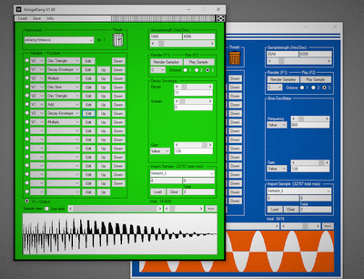

# AmigaKlang

**Modular sample synthesizer for Commodore Amiga, Atari ST and Acorn Archimedes**
by Virgill / Alcatraz, Haujobb, Maniacs of Noise



AmigaKlang is a sample creation tool for demoscene productions. It renders
instruments offline via a modular node graph -- similar to 4klang by
Gopher/Alcatraz -- and exports them to ProTracker `.mod` files, WAV, raw
samples, or standalone Amiga/Atari executables. Saving sample memory is its
main goal: instead of storing large PCM data, samples are generated from
compact instrument descriptions at load time.

This repository contains the WinForms editor (C#/.NET) plus all supporting
assets (Topaz font, cursors, icons) required to build it from source.

Pouet entry: <https://www.pouet.net/prod.php?which=85351>

---

## Features

- Up to 16 slots per instrument with freely routable node graphs (variables V1--V4)
- 25+ synthesis, filter, envelope, and utility nodes (see Function Reference below)
- Sample import pipeline (WAV/RAW) with delta encoding for compact executables
- Exporters for `.akp` patch banks, `.aki` single instruments, `.mod` templates, `.wav`, and `.txt`
- Amiga executable export (links song data, instrument data, and replayer into a single `.exe`)
- Amiga binary export (relocatable render code for integration in demos)
- Optional Atari ST palette, cursors, and toolbar

---

## File Types

| Extension | Description |
|-----------|-------------|
| `.aki` | Single instrument |
| `.akp` | Patch bank (up to 31 instruments) |
| `.raw` | Headerless 8-bit sample (ProTracker compatible) |
| `.exe` | Amiga executable music |
| `.bin` | Amiga binary for demo integration |

---

## Quick Start

### Creating an instrument

1. Select an empty instrument slot (start with instrument 1).
2. Set the sample length with the slider at the top right.
3. Each instrument has 16 slots. In every slot, pick a working variable (V1..V4) and a function.
4. Press Edit to view and change the function parameters.
5. The final result must end up in V1 -- this is always the output.
6. Press F1 to render all instruments, F2 to play/stop.

### Exporting samples to a .mod file

Save -> Export Samples to mod, then pick a `.mod` file. All existing sample
data in that file will be overwritten.

### Exporting to an Amiga executable

Save -> Export executable, then pick a `.mod` file. The resulting
`exemusic.exe` appears in the `exe_creator` subfolder.

### Exporting to an Amiga binary

Save -> Export binary. The resulting `exemusic.bin` appears in the
`exe_creator` subfolder.

The binary contains relocatable code. Place it anywhere in memory and call it
with the following register setup:

| Register | Contents |
|----------|----------|
| a0 | Start address for rendered samples (chip memory) |
| a1 | Temporary render buffer (65536 bytes) |
| a2 | External samples, if used (include `Ismp.raw`) |
| a4 | Progress counter address (e.g. for a progress bar) |

---

## Function Reference

### Oscillators

**Osc Saw** (fast) -- Sawtooth oscillator.
frequency: 0..10000 (or variable), gain: 0..127 (or variable), output: 16-bit

**Osc Triangle** (fast) -- Triangle oscillator.
frequency: 0..10000, gain: 0..127, output: 16-bit

**Osc Sine** (medium) -- Approximated sine oscillator.
frequency: 0..10000, gain: 0..127, output: 16-bit

**Osc Pulse** (fast) -- Rectangle oscillator.
frequency: 0..10000, pulsewidth: 0..127 (64 = square), gain: 0..127, output: 16-bit

**Osc Noise** (fast) -- White noise.
gain: 0..127, output: 16-bit

### Envelopes

**Env Attack** (fast) -- Simple attack envelope.
attack time: 0..127, gain: 0..127, output: 0..32767

**Env Decay** (fast) -- Simple decay envelope.
decay time: 0..127, sustain: 0..127, gain: 0..127, output: 0..32767

### Math / Utility

**Volume** (fast) -- Scale amplitude.
value: input variable, gain: 0..127, output: 16-bit

**Add** (fast) -- Addition with clamp.
value1: input variable, value2: -32768..32767 (or variable), output: 16-bit

**Multiply** (fast) -- Scales input from -1.0 to 1.0.
value1: input variable, value2: -32768..32767 (or variable), output: 16-bit

**Clamp** (fast) -- Clamps signal without wrapping.
value: input variable, output: 16-bit

**Ctrl Signal** (fast) -- Converts 16-bit signal to control range.
value: input variable, output: 0..127

### Effects

**Delay** (medium) -- Simple delay line.
value: input variable, delay: 0..2047 samples (or variable), gain: 0..127, output: 16-bit

**Comb Filter** (medium) -- Delay with feedback.
value: input variable, delay: 0..2047, feedback: 0..127, gain: 0..127, output: 16-bit

**Reverb** (very slow) -- Freeverb implementation.
value: input variable, feedback: 0..127, gain: 0..127, output: 16-bit

**SV Filter** (slow) -- State-variable filter (LP/HP/BP/Notch).
value: input variable, cutoff: 0..127, resonance: 0..127 (0 = max), output: 16-bit

**Sample and Hold** (medium) -- Reduces sampling frequency.
value: input variable, step: 0..127, output: 16-bit

### Sampling / Cloning

**Clone Sample** (fast) -- Clones a sample from a previous instrument (not instrument 1).
samplenr, backwards: yes/no, output: 16-bit

**Chord Gen** (slow) -- Creates a 4-note chord from a previous instrument (not instrument 1).
samplenr, note1..note3: 0..12 (0=none), shift: 0..127, output: 16-bit

**Imported Sample** (fast) -- Uses a sample from the import list.
samplenr, output: 16-bit

**Loop Gen** (slow) -- Generates a smooth crossfade loop (last slot only).
repeat offset: 0..65536, repeat length: 2..65536, output: 16-bit

---

## Tips and Tricks

- Use Noise + Sample and Hold to build a random modulation source.
- Feed one oscillator into another's frequency input for FM synthesis.
- Modulate the shift parameter of the Chord Generator for flanger-style effects.
- Convert 16-bit to 8-bit range: multiply by 128.
- Variables persist across the render loop -- use that for feedback and phase-modulation tricks.
- Apply a subtle highpass filter to remove DC offsets.
- Copy a variable to another with Add (value2 = 0).

---

## Building from Source

### Requirements

- Windows with Visual Studio 2022 (Community Edition is sufficient)
- .NET Framework 4.7.2 Developer Pack
- NuGet packages from `AmigaKlangGUI/packages.config` (currently NAudio 1.10.0)

### Steps

```powershell
git clone https://github.com/virgill1974/AmigaKlang.git
cd AmigaKlang
```

1. Open `AmigaklangGUI.sln` in Visual Studio.
2. Restore NuGet packages (VS prompts automatically, or run `nuget restore`).
3. Build Debug or Release.
4. Run `AmigaKlangGUI.exe` from `bin/<config>/`.

The cursor, font, and icon files at the repo root must stay next to the
executable if you copy it out of the build folder.

---

## Repository Layout

```
AmigaKlang/
+-- README.md
+-- .gitignore
+-- AmigaklangGUI.sln
+-- AmigaKlangGUI/          C# sources, resources, project file
|   +-- Properties/
|   +-- Resources/
+-- docs/
|   +-- screenshot.gif
+-- Topaznew.ttf             Amiga Topaz font
+-- *.cur                    Amiga / Atari pointer themes
+-- trashcan.png             UI icon asset
```

Build outputs, `.vs/` caches, `bin/`, `obj/`, and NuGet `packages/` folders
are excluded via `.gitignore`.

---

## Known Issues

- The built-in MOD player does not support CIA timing yet.
- Oscillator frequency values are not real physical frequencies.
- A Chord Gen note wider than half the source sample length will produce garbage.

---

## Credits

**Hellfire** / Haujobb -- code improvements
**Gopher** / Alcatraz -- 4klang and node architecture insights
**Bartman** / Abyss -- VSCode Amiga Debug and Makefile help
**Blueberry** / Loonies -- Shrinkler executable packer
**Leonard** / Oxygene -- LSP converter, Atari playback
**Dan** / Lemon -- binary export help and motivation
**Soundy** -- Paula HW register explanations
**Bifat** -- configuration testing
**Juice** -- bug hunting and improvement ideas
**H0ffman** -- C# tricks and discussions
**Aceman** -- testing and reporting
**Stingray** -- play routine tips
**Antiriad** -- integration testing
**LJ and xTr1m** -- algorithm discussions
**Magic** -- moral support

And many others.

---

## Acknowledgements

- Amiga system-includes (NDK 3.9) from Bebbo's amiga-gcc, modified for GCC 8
- Shrinkler executable packer by Blueberry/Loonies
- GCC 8.3.0 (C) 2018 Free Software Foundation, GPLv3+
- GNU Binutils 2.32 (C) 2019 Free Software Foundation, GPLv3+
- elf2hunk (C) 1995-2017 AROS Development Team, modified by Bartman/Abyss
- GNU Make 4.2.1 (C) 1988-2016 Free Software Foundation, GPLv3+
- NAudio .NET audio library by Mark Heath

---

## License

To be defined. Until a license is published, treat the code as
"all rights reserved" and request permission before redistributing.
